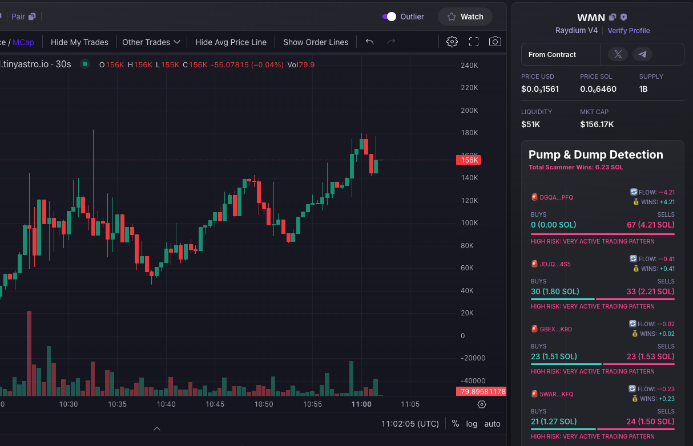

# Exit Liquidity Shield 🛡️

Exit Liquidity Shield is a browser extension that helps protect traders from pump and dump schemes on photon-sol.tinyastro.io by tracking and analyzing wallet activities in real-time.

## Support the Project ❤️

If you find this tool helpful, consider supporting me, every donation helps me continue creating useful tools for the community:

```
SOL: 3VpNWv517ccnshXFCKYgf3GeAxk4DzhrowhQEa3rrUrn
ETH: 0xfe89834C92C399E720F457bB73fEa1EFe1D0e17D
```

## Features

- 📊 Real-time wallet activity tracking
- 🔍 Identifies suspicious trading patterns
- 💰 Monitors buy/sell volumes
- ⚡ Lightweight and efficient
- 🔒 Privacy-focused (no data collection)

### Example of a Pump & Dump Pattern


_This chart shows a typical pump & dump pattern where price is artificially inflated before a sharp sell-off_

## Installation

### Chrome

1. Download or clone this repository
2. Open Chrome and go to `chrome://extensions/`
3. Enable "Developer mode" in the top right
4. Click "Load unpacked"
5. Select the folder containing the extension files
6. The extension icon should appear in your toolbar

### Firefox

1. Download or clone this repository
2. Open Firefox and go to `about:debugging`
3. Click "This Firefox" on the left sidebar
4. Click "Load Temporary Add-on"
5. Navigate to the extension folder and select `manifest.json`
6. The extension icon should appear in your toolbar

### Opera

1. Download or clone this repository
2. Open Opera and go to `opera://extensions`
3. Enable "Developer mode" in the top right
4. Click "Load unpacked"
5. Select the folder containing the extension files
6. The extension icon should appear in your toolbar

## Usage

1. Visit [photon-sol.tinyastro.io](https://photon-sol.tinyastro.io/)
2. The extension will automatically start monitoring wallet activities
3. Click the shield icon in your toolbar to see current statistics
4. Watch for suspicious patterns in wallet behaviors

## Development

### Project Structure

```
exit-liquidity-shield/
├── manifest.json
├── popup.html
├── content.js
└── icons/
├── icon16.png
├── icon32.png
├── icon48.png
└── icon128.png
```

### Building from Source

1. Clone the repository:

```bash
git clone https://github.com/yourusername/exit-liquidity-shield.git
```

2. Make your modifications
3. Test the extension in your browser using the installation steps above

## Contributing

1. Fork the repository
2. Create your feature branch (\`git checkout -b feature/AmazingFeature\`)
3. Commit your changes (\`git commit -m 'Add some AmazingFeature'\`)
4. Push to the branch (\`git push origin feature/AmazingFeature\`)
5. Open a Pull Request

## License

Distributed under the MIT License. See \`LICENSE\` for more information.

## Security

This extension only runs on photon-sol.tinyastro.io and requires minimal permissions for maximum security. It does not collect or transmit any user data.

## Support

For support, please open an issue in the GitHub repository.

## Disclaimer

This tool is for informational purposes only and should not be considered financial advice. Always do your own research before making investment decisions.
